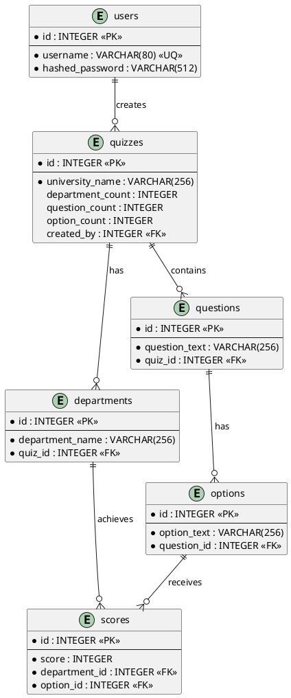

# Nitech Department App

受験生が自分に合う大学の学科を見つけるための、適性診断クイズ作成・回答アプリケーションです。

ユーザーは大学・学科・質問・選択肢・スコアを設定してオリジナルの学科診断クイズを作成できます。受験生は公開されたクイズに回答し、スコアが最も高い学科と AI コメントを確認できます。

## 目次

- [開発した背景](#開発した背景)
- [アプリ公開URL](#アプリ公開url)
- [アプリに関する記事](#アプリに関する記事)
- [主な機能](#主な機能)
- [使用技術](#使用技術)
- [環境構築手順](#環境構築手順)
- [Render でのデプロイ設定](#render-でのデプロイ設定)
- [こだわり・工夫した点](#こだわり工夫した点)
- [ダイアグラム](#ダイアグラム)
- [API・ルーティング一覧](#apiルーティング一覧)
- [今後の展望](#今後の展望)

## 開発した背景

大学受験塾でアルバイトをする中で、多くの受験生が「どの大学に行きたいか」は考えていても、「どの学科で何を学びたいか」までは十分に検討できていないことに気づきました。

理系分野では、学科によって学ぶ内容、研究テーマ、就職先、大学生活の過ごし方が大きく変わります。一方で、受験生が各学科の違いを具体的に知る機会は限られており、情報不足のまま進路を選ぶケースもあります。

このアプリは、大学や学科に詳しい人が診断クイズを作成し、受験生が回答を通して自分に合いそうな学科を知ることを目的に開発しました。

## アプリ公開URL

- 公開URL: [https://nitech-department-app.onrender.com/](https://nitech-department-app.onrender.com/)

## アプリに関する記事

- 開発の流れ: [Qiita記事](https://qiita.com/hayashi1917/items/793d0252fc930c7451ed)
- 主な機能: [Qiita記事](https://qiita.com/hayashi1917/items/0331fc131b313b23792e)

## デモ動画・スクリーンショット

- トップページ
- クイズ一覧画面
- クイズ作成画面
- 診断結果画面

## 主な機能

- ユーザー登録・ログイン・ログアウト
- 診断クイズの作成
- 大学名、学科数、質問数、選択肢数の設定
- 学科名、質問文、選択肢、学科ごとのスコア設定
- 作成済みクイズの一覧表示
- クイズ回答機能
- 回答結果に応じた最適学科の表示
- OpenAI API による診断コメント生成
- OpenAI API の利用制限時のフォールバック表示
- クイズ削除

## 使用技術

| カテゴリ | 技術 |
| --- | --- |
| バックエンド | Python 3.11.11, Flask 2.2.5 |
| ORM / DB操作 | Flask-SQLAlchemy 3.1.1, SQLAlchemy 2.0.23 |
| マイグレーション補助 | Flask-Migrate 4.0.4 |
| 認証 | Flask-Login 0.6.2, Werkzeug 2.2.3 |
| データベース | PostgreSQL |
| AI API | OpenAI API, openai 0.27.0 |
| WSGI サーバー | Gunicorn 20.1.0 |
| フロントエンド | HTML, CSS, Bootstrap |
| デプロイ | Render |

## 環境構築手順

### 1. リポジトリをクローン

```bash
git clone https://github.com/hayashi1917/Nitech-Department-App.git
cd Nitech-Department-App
```

### 2. 仮想環境を作成

```bash
python3 -m venv venv
source venv/bin/activate
```

Windows の場合:

```bash
python -m venv venv
venv\Scripts\activate
```

### 3. 依存関係をインストール

```bash
pip install -r requirements.txt
```

### 4. 環境変数を設定

プロジェクトルートに `.env` を作成します。

```dotenv
FLASK_APP=run.py
SECRET_KEY=任意のランダム文字列
DATABASE_URL=postgresql://ユーザー名:パスワード@ホスト名:5432/データベース名
OPENAI_API_KEY=OpenAI APIキー
```

`DATABASE_URL` が設定されている場合、アプリは `DB_HOST` / `DB_USER` / `DB_PASS` / `DB_NAME` よりも `DATABASE_URL` を優先します。

### 5. データベースのテーブルを作成

初回のみ実行します。

```bash
flask init-db
```

### 6. アプリを起動

```bash
flask run
```

起動後、以下にアクセスします。

```text
http://localhost:5000
```

## Render でのデプロイ設定

Render の Web Service では以下の設定を使用します。

### Build Command

```bash
pip install -r requirements.txt
```

### Start Command

```bash
gunicorn -b 0.0.0.0:$PORT run:app
```

### Environment Variables

```dotenv
SECRET_KEY=任意のランダム文字列
DATABASE_URL=Render Postgres の Database URL
OPENAI_API_KEY=OpenAI APIキー
```

Render Postgres の Internal Database URL を使う場合、Web Service と PostgreSQL は同じ workspace / region に配置する必要があります。接続できない場合は External Database URL を `DATABASE_URL` に設定します。

### 初回データベース作成

Render 上で初回のみ以下を実行します。

```bash
flask init-db
```

Render Shell が使えない場合は、一時的に Start Command を以下に変更してデプロイします。

```bash
flask init-db && gunicorn -b 0.0.0.0:$PORT run:app
```

テーブル作成後は、Start Command を必ず通常の起動コマンドに戻します。

```bash
gunicorn -b 0.0.0.0:$PORT run:app
```

## こだわり・工夫した点

- 診断クイズを管理者固定ではなく、ログインユーザーが作成できる構成にしました。
- 学科数、質問数、選択肢数を可変にし、大学や目的に合わせた診断クイズを作れるようにしました。
- 選択肢ごとに各学科へのスコアを設定し、回答結果から最も適性が高い学科を算出します。
- 診断結果に OpenAI API のコメントを加え、単なるスコア表示だけでなく受験生向けの補足説明を表示します。
- OpenAI API の利用上限や一時的な失敗が発生しても、診断結果ページ自体は表示できるようにしています。
- Render 環境では `DATABASE_URL` を優先して読み込むことで、PostgreSQL 接続設定をシンプルにしました。

## ダイアグラム

### ER図



## API・ルーティング一覧

| メソッド | パス | 概要 | 認証 |
| --- | --- | --- | --- |
| GET | `/` | トップページ | 不要 |
| GET | `/select` | クイズ一覧表示 | 不要 |
| GET / POST | `/quiz/<quiz_id>/<question_id>` | クイズ回答 | 不要 |
| GET | `/result/<quiz_id>` | 診断結果表示 | 不要 |
| GET / POST | `/login/` | ログイン | 不要 |
| GET | `/login/logout` | ログアウト | 不要 |
| GET / POST | `/login/signup` | ユーザー登録 | 不要 |
| GET / POST | `/step1` | クイズ基本情報入力 | 必要 |
| GET / POST | `/step2` | 学科名入力 | 必要 |
| GET / POST | `/step3` | 質問文入力 | 必要 |
| GET / POST | `/step4` | 選択肢・スコア設定、クイズ保存 | 必要 |
| GET | `/showquiz/` | 作成済みクイズ表示 | 不要 |
| GET | `/delete/<quiz_id>` | クイズ削除 | 実装上は認証必須ではない |
| GET | `/quiz/clear_session` | 回答セッション初期化 | 不要 |

## 今後の展望

- レスポンスの向上（SPAによる実装）
- 診断結果の共有機能
- Docker によるローカル環境構築の簡略化
- クイズ作成作業の簡素化